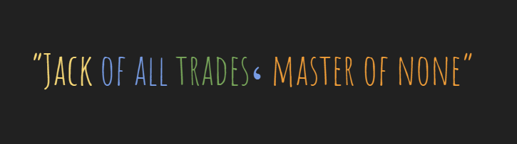
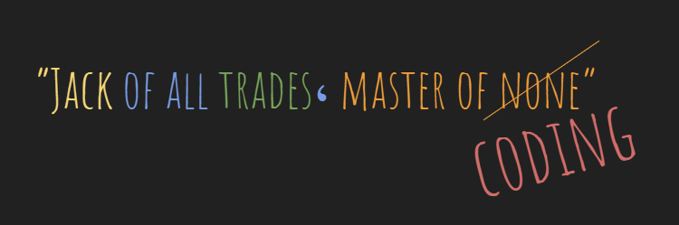

# 👋 Hello, I'm Amira

Here's a bit about me:

## About Me

- 🌍 Location: Antwerp,BE.
- 🏫 Education: BSc in Geophysics.
- 🎓 Learning code at Hack Your Future.
- 💻 Just started with Full stack development program.
- 👩‍💻 Programming Languages: HTML & CSS
- 🛠️ Trying to understand Git and GitHub

## Interests

- 🔭 Learning new things!
- 💃 Dancing
- 👩‍🍳 Cooking
- 📖 Reading
- 🎨 Drawing
- ✈ Traveling
- 🧩 Puzzle and Board games

I've tried a bit of everything ... dancing, cooking and art. While I've explored
these areas with enthusiasm, I haven't taken any of them to a professional
level.

I am simply👇

> 

**But now I'm all in for coding** **It's my chosen path, and I'm excited to see
where it takes me!** Looking forward to transforming this soon to 👇👇

> 
